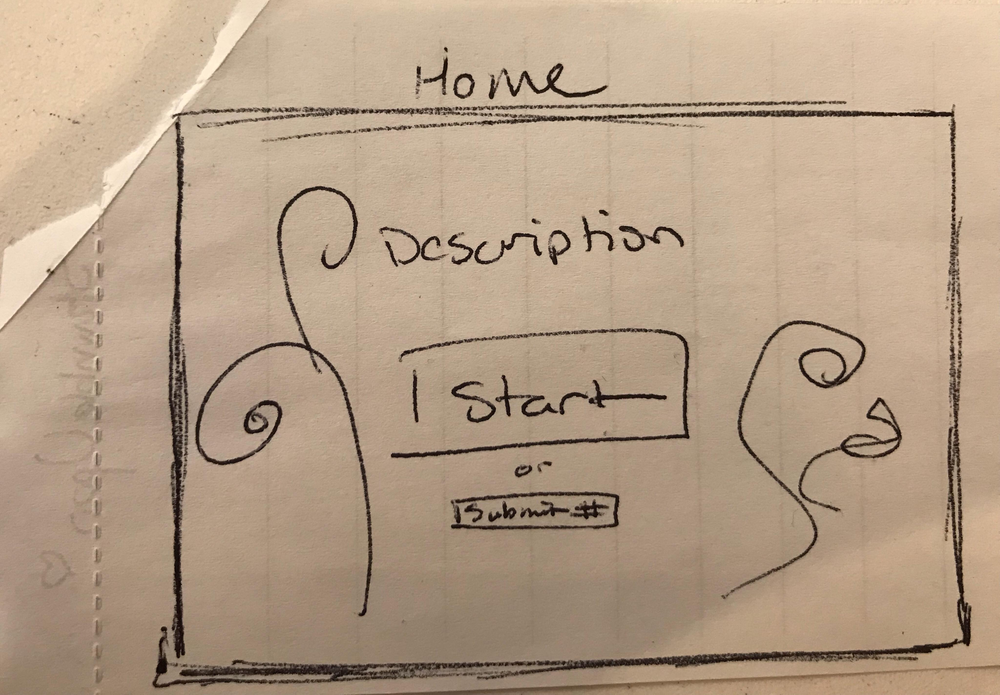

# The Idea

We are building a website similar to StumbleUpon (a website for discovering new websites). Users can click to randomly show a website. Users can add in links to their favorite websites and have to display on the page for other users. Users can comment about the sites.

We will have a secret link that only us (admins) can access in order to update or delete things.

# Models

_1. Websites_ : Title, Website Link, Like/Dislikes
_2. Comment_: Username, Text, Date

# Wireframe

