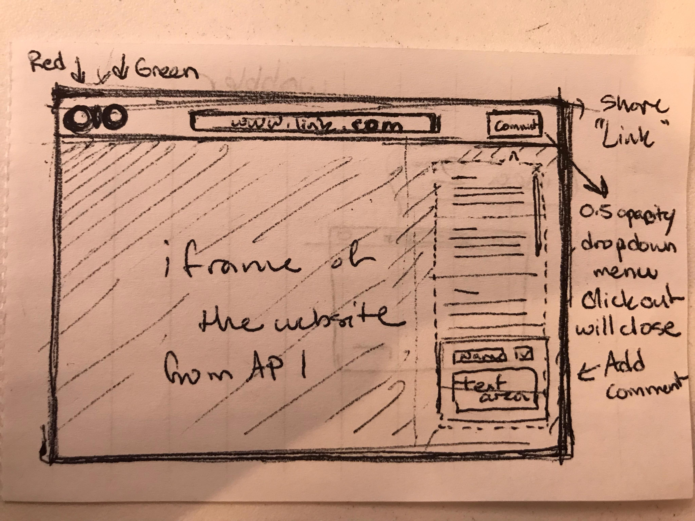

# Wobbler - Front End

Wobble is a random website generator to bring you the best (and most random) parts of the web at a click of a button. This project is an attempt at a [Stumble Upon](www.stumbleupon.com) clone. This repo is for front end with full connection to our backend full CRUD functionality on our main set of data. The front end can be found [here](https://github.com/dbf8/Wobble_Back_End). Users can click to randomly show a website. Users can add in links to their favorite websites and have to display on the page for other users. Users can comment about the sites.

We will have a secret link that only us (admins) can access in order to update or delete things.

# Models

_1. Websites_ : Title, Website Link, Like/Dislikes
_2. Comment_: Username, Text, Date

# Wireframe

## Getting Started

* Clone.
* `$ npm Install`
* Run the backend.
* Run your server with `$ npm start` 

## Built With
* React
* Express
* Node
* MongoDB
* Love

## Authors

* **Daniel Freudberg** - [dbf8](https://github.com/dbf8)
* **Nhi Nguyen** - [nnguy152](https://github.com/nnguy152)
* **Mei Chen** - [meichen](https://github.com/meichen)

## Deployed

Back end: [Heroku](https://wobble-back-end.herokuapp.com/api/websites)
Front end: [Surge](http://wobble.surge.sh/)

## Acknowledgments

* Inspiration: Stumbleupon.com
* Special thanks to Sam and Jeff for last minute troubleshooting.
